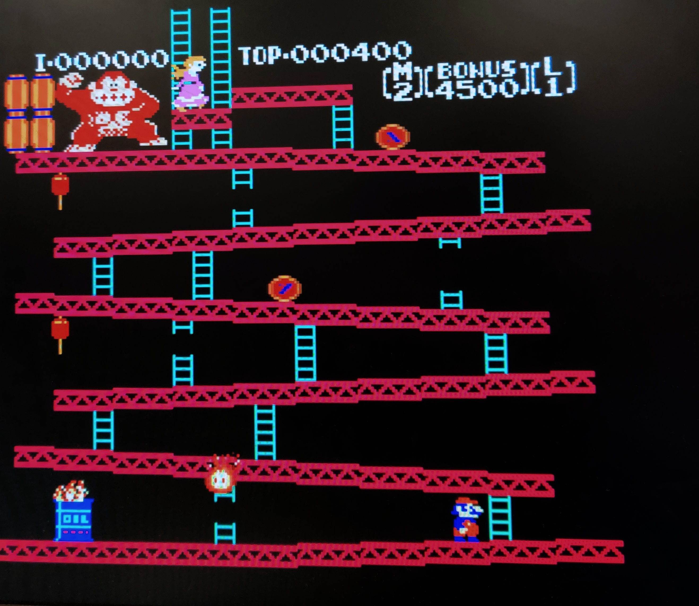

# Final Project ECE 385

Our final project is a mostly complete NES emulator on the FPGA that can successfully run Donkey Kong, Super Mario Bros., and Xevious (more games using NROM may run, but were untested). It has a single virtual “controller” that is mapped to our PS/2 keyboard with WASD for movement, and F, G, V, and B for buttons B, A, select, and start respectively. The output is rendered to a VGA output, upscaled by 2x.

The high level components of our design were the 6502 CPU (processor), the PPU (Picture Processing Unit) (graphics processor), the VGA controller (which uses a double buffer), the mapper for the cartridge, and the PS/2 controller to NES virtual controller interface. Additionally, we only support mapper 0 (a.k.a. NROM) as each cartridge is an ASIC which can contain special hardware for sound (e.g. Castlevania III), rendering, math, etc. Mapper zero is the simplest mapper.

Our processor only supports the official 6502 instructions (many later games in the NES generation used unofficial instructions which were not intended for use, but they still had functionality). We used the PS/2 keyboard for input. The instructions are stored in SRAM.
